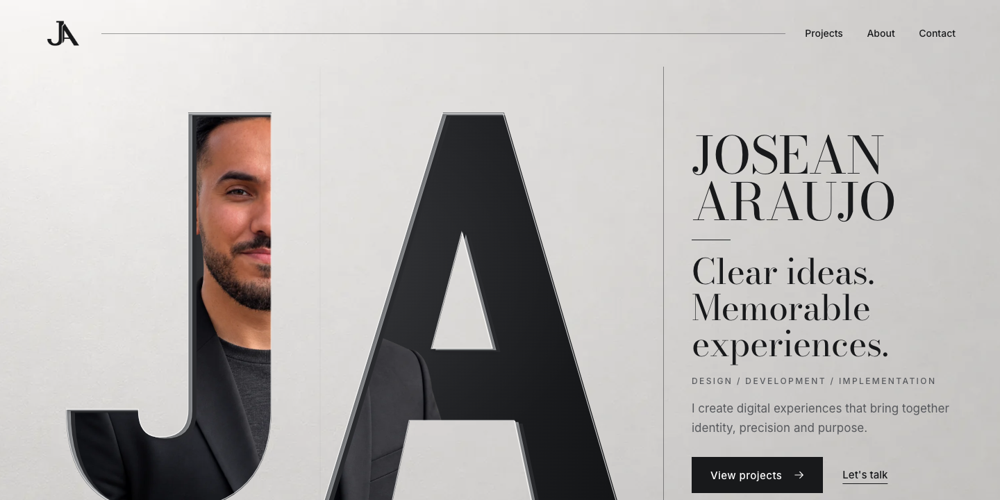
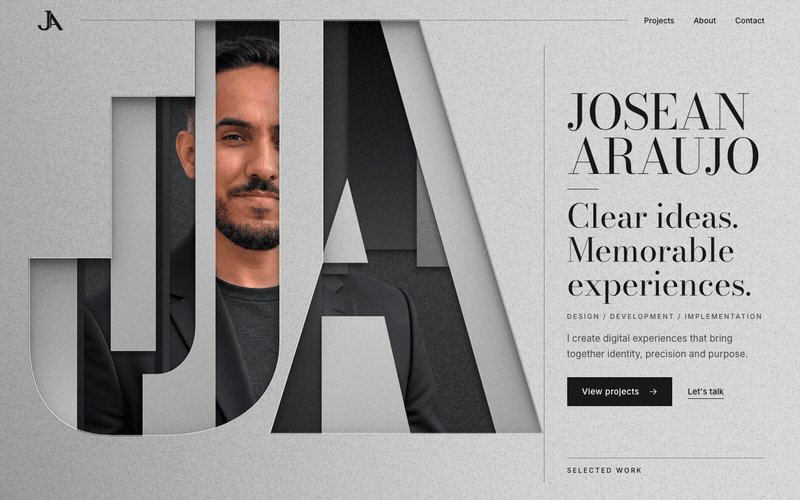
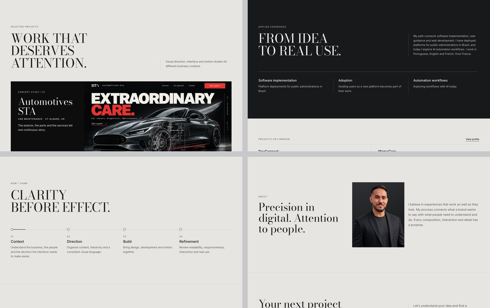
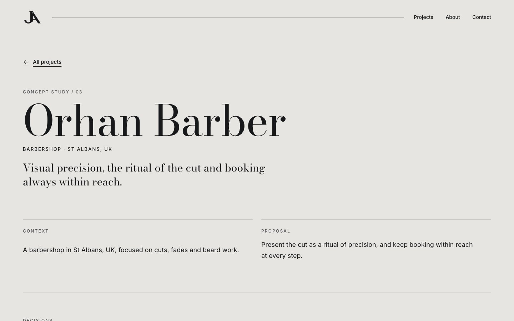
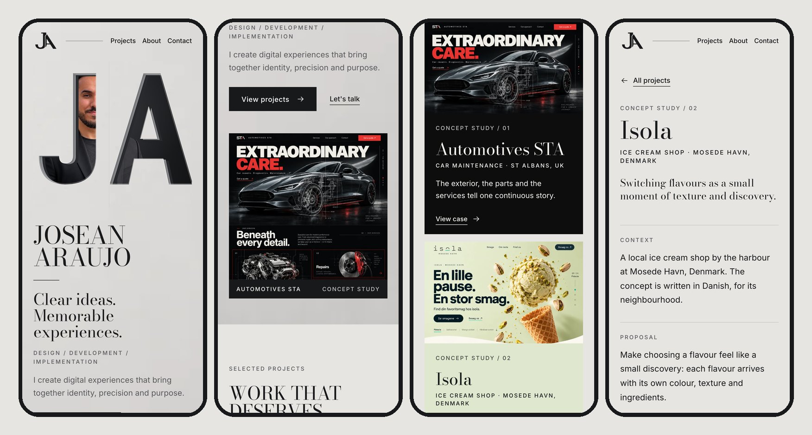

<div align="center">



<h3>An editorial portfolio where the JA monogram becomes an author's window: the letters open on scroll and hand their frame to the first project.</h3>

<p>
  <a href="#hero-animation"><strong>🎬 How the hero works</strong></a>
  &nbsp;·&nbsp;
  <a href="#case-studies"><strong>🧭 Case studies</strong></a>
  &nbsp;·&nbsp;
  <a href="#getting-started"><strong>🛠️ Run it locally</strong></a>
</p>

<p>
  
  
  
  
  
</p>

</div>

<br />

## 🚀 Overview

**Josean Araujo** connects visual intent, development and the real use of technology. This portfolio is built from the **Metal Editorial** kit (`josean-portfolio-metal-editorial/`): natural photography, author typography and precise motion, in graphite, satin silver and light grey.

The first screen is a signature. Monumental **J** and **A** letters, cut from a satin silver plate, reveal fragments of a single portrait. As you scroll, the plates part, the opening grows, the cut-outs leave through the edges and a rectangular window takes over the same frame to show the first project. After that the motion ends, and the rest of the page is about reading, choosing a case and starting a conversation.

- **One signature, one window, the work**: a pinned 140 vh sequence on desktop, written scene by scene in the kit
- **Content first**: every word, link and case is HTML, readable without JavaScript and without the animation
- **Honest cases**: six concept studies, each labelled *Concept study*, with context, proposal, decisions, screens and motion; no invented results, clients or metrics
- **One contact**: LinkedIn, the only channel supplied

<br />

<a name="hero-animation"></a>

## 🎬 The hero animation

<div align="center">
  
  <sub>Scroll-scrubbed · captured at 1440 × 900 from the production build</sub>
</div>

<br />

The entrance takes 1.4 s (`02-roteiro-de-movimento.md`): the portrait fades in under the openings (0–0.4 s), the graphite planes set back 6–12 px (0.2–0.9 s) and one light change runs along the edge of the J and stops (0.7–1.4 s). Scrolling during the entrance takes over immediately. After that the hero follows the kit's scroll timeline (`07-integracao/scroll-timeline.json`):

| Scroll   | Scene         | What happens                                                                              |
| :------- | :------------ | :---------------------------------------------------------------------------------------- |
| 0–20%    | **Signature** | JA cut-outs and portrait at rest; name, proposal and actions readable                     |
| 20–42%   | **Depth**     | The planes part up to 24 px; the portrait moves 18 px at most                              |
| 42–62%   | **Opening**   | The counterform grows and reveals the author; the portrait keeps its geometry             |
| 62–82%   | **Framing**   | Cut-outs leave through the edges; a rectangular window grows over the art, revealed by mask |
| 82–100%  | **Work**      | The portrait fades; Automotives STA takes the same window, scaling from 0.78 to 1          |

**Under the hood**

- 🧱 **Layers, not video.** Silver background → portrait → two graphite shadow planes → light plates with openings → edge light → HTML text, exactly the order in `04-producao.md`. The plates are the kit's production SVGs (`04-camadas/placa-*.svg`, viewBox 1040 × 960) used as CSS masks.
- 👤 **One portrait, every scene.** The same transparent PNG is contained in the art and never deformed. It is offset so the J opening always shows one eye: the openings never cover both.
- 🪨 **One continuous sheet.** At rest the plates carry the same `fundo-prata` texture as the page, aligned to the stage in JS, so the letters read as cuts in a single plate, not as a box on top of it.
- 🎚️ **Scroll-scrubbed, never forced.** Native scroll with a sticky stage: no wheel hijacking, no smoothing layer, no locked navigation. Effects pause when the hero leaves the screen.
- 🐢 **Graceful by default.** Below 1024 px there is no pin and no camera: art above, text below, and the project window enters right after the introduction. With `prefers-reduced-motion` the composition is static.

<br />

## 🖥️ Sections

<div align="center">
  
</div>

<br />

| #   | Section                                               | Anchor        | Role                                                                                 |
| :-- | :---------------------------------------------------- | :------------ | :----------------------------------------------------------------------------------- |
| 01  | **Clear ideas. Memorable experiences.**               | `#top`        | Signature, proposal, *View projects* and *Let's talk*                                |
| 02  | **Work that deserves attention.**                     | `#projects`   | Three wide cases (Automotives STA, Isola, Orhan Barber), then an index of the others |
| 03  | **From idea to real use.**                            | `#experience` | Short bio from LinkedIn, three areas, and DevConnect / MamaCare kept as text rows    |
| 04  | **Clarity before effect.**                            | `#process`    | Context → Direction → Build → Refinement; a short stroke follows the step in focus   |
| 05  | **Precision in digital. Attention to people.**        | `#about`      | Static portrait and an authored paragraph                                             |
| 06  | **Your next project starts with a conversation.**     | `#contact`    | One action: *Let's talk on LinkedIn*                                                 |

<br />

<a name="case-studies"></a>

## 🧭 Case studies

<div align="center">
  
</div>

<br />

Each concept has its own static page at `/work/<slug>/`, in the order the kit asks for: **context / proposal / decisions / screens / motion**, plus *implementation* once a public link exists. Pages are generated from one data file, so the home cards and the case pages never drift apart.

| #   | Concept             | Theme          | What the case explains                               |
| :-- | :------------------ | :------------- | :--------------------------------------------------- |
| 01  | **Automotives STA** | Car maintenance | How the exterior, the parts and the services build one narrative |
| 02  | **Isola**           | Ice cream shop | Switching flavours, texture and discovery            |
| 03  | **Orhan Barber**    | Barbershop     | Visual precision, ritual and access to booking       |
| 04  | **Legend Nails**    | Manicure       | Editorial reference and finish                       |
| 05  | **Bayro Cut**       | Barbershop     | Attitude, opening and service hierarchy              |
| 06  | **M&M Cleaning**    | Cleaning       | Reorganising the space, in layers                    |

<br />

## 📱 Mobile first, motion optional

<div align="center">
  
</div>

<br />

- Art above, name, proposal and actions below; the head is never cropped to keep the giant letters
- One column for content and the project list, 24 px margins
- Every touch target is at least 44 px; no horizontal scroll at 360, 390, 768, 1024 or 1440 px
- Nothing depends on hover: cards and index rows respond to tap and keyboard focus; the process stroke is decorative and never hides content

<br />

## ✨ Highlights

- **🪟 Author window**: the scroll sequence is computed from the kit's scene ranges with the same smoothstep as the kit's motion study
- **🧾 Works without JavaScript**: name, proposal, calls to action and all six cases are plain HTML; JS only adds the motion
- **🎯 Focus you can see**: a 2 px graphite ring (white on dark), a skip link, and a hero window that stays `inert` until it is on screen
- **🖼️ Image pipeline**: the kit's PNGs stay untouched; light WebP derivatives (hero crops, thumbnails, portrait, monogram, favicons) come from `npm run assets`
- **🔤 Type that holds up**: Bodoni Moda at a fixed optical size, so hairlines survive on small screens; Inter for reading and interface
- **🧰 One source of truth**: `src/data/projects.js` feeds the home cards and the six case pages through `npm run pages`

<br />

## 💻 Tech stack

| <br />Vite 6 | <br />JavaScript | <br />HTML5 | <br />CSS3 | <br />Python (Pillow) | <br />Vercel |
| :---: | :---: | :---: | :---: | :---: | :---: |

### Why this stack?

- **Vite + plain JavaScript**: a portfolio is static HTML; the whole motion layer is about 4 KB of script
- **No animation library**: the sequence is a handful of transforms driven by scroll position, so it stays exact, seek-safe and easy to read
- **Self-hosted Bodoni Moda and Inter**: no third-party font requests; only the Latin subsets in use are downloaded
- **Pillow for derivatives**: crops and WebP files are reproducible from the kit with one command
- **Vercel**: static output, ready to connect to this repository

<br />

## 🎨 Design system

From `07-integracao/tokens.json`:

| Token                      | Value                                                                        | Use                                         |
| :------------------------- | :--------------------------------------------------------------------------- | :------------------------------------------ |
| Graphite                   |  | Text, buttons, experience band              |
| Cool paper                 |  | Page and plates                             |
| Satin silver               |  | Material, only in large art                 |
| Light surface              |  | Text on dark                                |
| Secondary text on light    |  | Labels, paragraphs (5.6:1 on paper)         |
| Secondary text on dark     |  | Paragraphs on graphite (9.7:1)              |
| Dividers                   |  | Rules                                        |

- **Type**: Bodoni Moda 400 for name and titles; Inter 400/500/600 for body, navigation and metadata; body 16–18 px
- **Grid**: 1440 px reference, 12 columns, 64 px margins (24 px on mobile); art on 8 columns, presentation on 4
- **Identity**: the flat JA master mark (black on light, white on dark) in the header and footer; the metallic treatment only in large art
- **Motion**: project images recede 3% on hover or focus; the experience divider draws once and its text rises 12 px in 450 ms; no counters, no carousels

<br />

<a name="getting-started"></a>

## 🛠️ Getting started

```bash
# Clone the repository
git clone https://github.com/Jeanfr1/portfoliojosean.git
cd portfoliojosean

# Install dependencies (Node 20+)
npm install

# Start the dev server  →  http://localhost:5173
npm run dev

# Production build  →  dist/
npm run build

# Preview the production build
npm run preview

# Regenerate the home work section and the six case pages from src/data/projects.js
npm run pages

# Regenerate the WebP derivatives from the kit (needs Python 3 + Pillow)
npm run assets
```

<br />

## 📁 Project structure

```
portfoliojosean/
├── index.html                      # Hero → work → experience → process → about → contact
├── work/<slug>/index.html          # Six case pages (generated, do not edit by hand)
├── src/
│   ├── data/
│   │   ├── projects.js             # The six concept studies: copy, crops, tones
│   │   └── motion.js               # Scene ranges mirrored from the kit's scroll timeline
│   ├── js/
│   │   ├── main.js                 # Entry: fonts, styles, modules
│   │   ├── hero.js                 # Author window: plates, depth, opening, framing, handoff
│   │   ├── reveal.js               # One-time entrances (experience, mobile window)
│   │   └── process.js              # The stroke that follows the step in focus
│   └── styles/main.css             # Tokens, grid, hero layers, sections, case pages
├── public/
│   ├── img/                        # WebP derivatives + the kit's SVG planes
│   ├── og.jpg                      # Open Graph image (a capture of the real hero)
│   └── favicon-32.png, apple-touch-icon.png
├── scripts/
│   ├── build-pages.mjs             # Data → work section + case pages
│   └── build-assets.py             # Kit PNGs → web derivatives
└── josean-portfolio-metal-editorial/  # The kit: direction, identity, layers, scripts, study (untouched)
```

<br />

## 🚀 Deployment

Configured for **Vercel** (`vercel.json`); the kit is excluded from uploads by `.vercelignore`. It has **not been published yet**: the kit asks to validate the portrait, copy, links and case labels first (see the checklist below). Once approved, import this repository in Vercel and every push to `main` ships to production.

| Setting          | Value           |
| :--------------- | :-------------- |
| Framework        | Vite            |
| Build command    | `npm run build` |
| Output directory | `dist`          |

<br />

## 📌 Content checklist

Items to validate before publishing (`04-producao.md`, `03-arquitetura-e-copy.md`). Open items are marked `TODO(josean)` in the code.

- [ ] Review the portrait's likeness
- [ ] Validate the authored **About** paragraph
- [ ] Confirm availability, the scope offered and any contact channel beyond LinkedIn
- [ ] Public links for the six concept studies (the `prototype` field in `src/data/projects.js` switches on *Implementation*)
- [ ] Real screens and links for **DevConnect** and **MamaCare**, to give them their own cases
- [ ] Check the LinkedIn link and every *Concept study* label
- [ ] Custom domain (then make `og:image` absolute and add `canonical`)
- [ ] For print: redraw the approved JA monogram as vector curves (the PNGs are not vectors)

<br />

## 🙏 Acknowledgments

- **Metal Editorial kit**: visual direction, JA identity, layers and motion script
- **[Bodoni Moda](https://fonts.google.com/specimen/Bodoni+Moda)** by Owen Earl (OFL), self-hosted via Fontsource
- **[Inter](https://rsms.me/inter/)** by Rasmus Andersson (OFL), self-hosted via Fontsource
- **[Vite](https://vite.dev)** and **[Vercel](https://vercel.com)**

<br />

---

<div align="center">
  
  <p><strong>Josean Araujo / Design and technology</strong></p>
  <p>Built with ❤️ by <a href="https://github.com/Jeanfr1">Jean</a></p>
</div>
